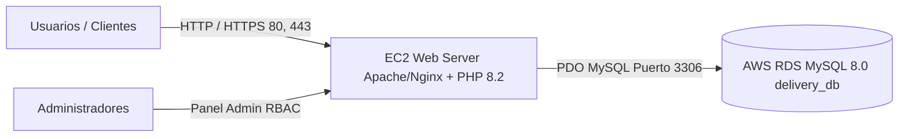

# Fast Delivery - Guía de Despliegue en AWS (EC2 + RDS MySQL)

Esta guía explica paso a paso cómo desplegar la plataforma **Fast Delivery** en Amazon Web Services utilizando una instancia **EC2** para la aplicación PHP y una base de datos administrada **RDS MySQL 8.0+** utilizando el script [SQL.db](file:///c:/Users/ASUS/Desktop/FastDelivery/SQL.db).

---

## 1. Arquitectura de la Solución



---

## 2. Configuración de la Base de Datos en AWS RDS

1. **Crear la Instancia RDS**:
   - Motor: **MySQL Community** (Versión 8.0 o superior).
   - Plantilla: **Capa gratuita (Free Tier)** o Producción (Multi-AZ).
   - Identificador de BD: `fastdelivery-rds`.
   - Nombre de base de datos inicial: `delivery_db`.
   - Usuario Maestro: `admin` (o el de su preferencia).
   - Asignar una contraseña segura.

2. **Configuración de Red y Seguridad (Security Groups)**:
   - Crear un Grupo de Seguridad para RDS (ej: `rds-fastdelivery-sg`).
   - Regla de entrada: **MySQL/Aurora (Puerto 3306)** con origen en el Grupo de Seguridad de su instancia EC2 (`ec2-fastdelivery-sg`). **Nunca abrir el puerto 3306 a 0.0.0.0/0 en producción**.

3. **Importar el Script de Base de Datos**:
   Desde su terminal (conectado a la misma VPC o vía EC2):
   ```bash
   mysql -h <ENDPOINT-RDS-AQUI> -P 3306 -u admin -p delivery_db < SQL.db
   ```

---

## 3. Configuración del Servidor Web en AWS EC2

1. **Lanzar Instancia EC2**:
   - AMI: **Ubuntu 22.04 LTS** o **Amazon Linux 2023**.
   - Tipo de Instancia: `t3.micro` o `t3.small`.
   - Grupo de Seguridad: Permitir puertos `22` (SSH), `80` (HTTP), `443` (HTTPS).

2. **Instalación de Dependencias (Ubuntu)**:
   ```bash
   sudo apt update && sudo apt upgrade -y
   sudo apt install -y apache2 php libapache2-mod-php php-mysql php-mbstring php-xml php-curl git
   sudo a2enmod rewrite
   sudo systemctl restart apache2
   ```

3. **Clonar o Desplegar el Proyecto**:
   ```bash
   cd /var/www/html
   git clone <URL_REPOSITORIO> fastdelivery
   sudo chown -R www-data:www-data /var/www/html/fastdelivery
   ```

4. **Configurar el archivo `.env`**:
   Crear el archivo `/var/www/html/fastdelivery/.env`:
   ```ini
   DB_HOST=fastdelivery-rds.xxxxxx.us-east-1.rds.amazonaws.com
   DB_PORT=3306
   DB_NAME=delivery_db
   DB_USER=admin
   DB_PASS=SuContraseñaRDS_Aqui
   DB_CHARSET=utf8mb4
   ```

5. **Configurar VirtualHost de Apache (Opcional pero recomendado)**:
   ```apache
   <VirtualHost *:80>
       ServerAdmin webmaster@fastdelivery.com
       DocumentRoot /var/www/html/fastdelivery

       <Directory /var/www/html/fastdelivery>
           Options -Indexes +FollowSymLinks
           AllowOverride All
           Require all granted
       </Directory>

       ErrorLog ${APACHE_LOG_DIR}/fastdelivery_error.log
       CustomLog ${APACHE_LOG_DIR}/fastdelivery_access.log combined
   </VirtualHost>
   ```

---

## 4. Cuentas de Acceso por Defecto en la Base de Datos

Las cuentas iniciales creadas por [SQL.db](file:///c:/Users/ASUS/Desktop/FastDelivery/SQL.db) con contraseñas encriptadas con `BCRYPT`:

| Rol | Usuario / Correo | Contraseña | Destino al Iniciar Sesión |
| :--- | :--- | :--- | :--- |
| **Administrador** | `admin@fastdelivery.com` | `admin123` | [Panel de Productos (admin.php)](file:///c:/Users/ASUS/Desktop/FastDelivery/Frontend/admin.php) |
| **Cliente** | `cliente@fastdelivery.com` | `cliente123` | [Catálogo (index.php)](Frontend/index.php) |
| **Repartidor** | `repartidor@fastdelivery.com` | `repartidor123` | [Pedidos (mis_pedidos.php)](Frontend/mis_pedidos.php) |

El rol repartidor consulta sus pedidos asignados en `Frontend/mis_pedidos.php`. El administrador dispone de paneles de productos, usuarios y pedidos.


## Organización y flujos de la aplicación

- `Frontend/login.php` y `Frontend/register.php`: acceso y registro independiente. El registro público siempre crea clientes.
- `Frontend/checkout.php`: carrito editable y formulario de entrega/tarjeta. Requiere sesión, conserva el carrito al iniciar sesión y utiliza pago simulado; no envía ni guarda datos bancarios.
- `Frontend/admin.php?panel=productos|usuarios|pedidos`: panel verde con navegación lateral, acceso exclusivo de administradores y formularios simplificados.
- `Backend/bootstrap.php`: configuración y carga compartida. `config/` contiene la conexión PDO; `database/` la inicialización; `middleware/` la validación de sesión y rol; `controllers/` procesa solicitudes; `services/` contiene las operaciones de negocio.
- `Frontend/procesar_pedido.php` conserva la respuesta JSON (`status`, `mensaje`, `pedido`). Las compras requieren `checkout_token`, emitido por el checkout; repetir el mismo token devuelve el pedido ya registrado.
- `APP_TIMEZONE` permite configurar la zona horaria; por defecto se usa `America/Lima` tanto para PHP como para la sesión MySQL.

### Administración y conservación del historial

Los productos se desactivan al eliminarlos. Usuarios dispone de acciones distintas para desactivar y eliminar: la eliminación definitiva se rechaza si el usuario está vinculado como cliente o repartidor a pedidos. No se permite eliminar, desactivar ni quitar el rol al administrador conectado o al último administrador activo. Editar la contraseña dejándola vacía conserva el hash actual.

Pedidos permite consultar detalle y editar dirección, referencia, repartidor activo y estado. No permite crear pedidos manualmente ni editar sus productos. Eliminar cancela el pedido y restaura stock una sola vez; conserva los pagos y el historial, sin ejecutar reembolsos. No se pueden cancelar pedidos entregados ni reactivar los cancelados.

### Inicialización y pruebas

**SQL.db elimina las tablas existentes. No debe ejecutarse sobre una base con datos que se deban conservar.** La aplicación nunca ejecuta este script automáticamente. La entrada de inicialización está bloqueada por HTTP y requiere `php Backend/database/init.php --reset` por CLI, solo para bases nuevas o de pruebas.

`php tests/integration.php` copia únicamente la estructura de las tablas a un esquema temporal `fastdelivery_test_*`, ejecuta las pruebas y lo elimina al finalizar. Requiere permiso de MySQL para crear bases temporales; no modifica los registros de la base original. Para verificación HTTP/visual, `php tests/integration.php --keep` conserva el esquema y guarda su nombre en `.runtime/test-db.json`. Configurar `DB_NAME` con ese nombre antes de iniciar el servidor, y ejecutar `python tests/http_checks.py` contra `http://127.0.0.1:8765/Frontend/`. Al finalizar, detener el servidor y ejecutar `php tests/cleanup.php` para eliminar exclusivamente ese esquema de pruebas.

En entornos con directorios de sesión restringidos, usar `php -d session.save_path=RUTA_ABSOLUTA_ESCRIBIBLE -S 127.0.0.1:8765 -t .`. `.runtime/` está excluido de Git para sesiones y capturas temporales.


## Modo de presentación de la tarea

El modo `DEMO_MODE=true` está activado por defecto para esta entrega académica. En el login aparecen botones para entrar como administrador, cliente o repartidor sin escribir credenciales; cada botón selecciona la primera cuenta activa de ese rol que ya existe en MySQL. No crea ni reactiva cuentas automáticamente.

En el checkout, **Rellenar datos de prueba** completa una tarjeta ficticia y los datos de contacto/entrega que estén vacíos. Después se puede pulsar **Hacer pago** para registrar el pedido y mostrar la confirmación. Los campos de tarjeta siguen sin enviarse ni guardarse. Se conservan los controles de stock, la protección contra pedidos duplicados y las relaciones de MySQL para que la exposición no deje datos inconsistentes.

Configurar `DEMO_MODE=false` en `.env` restaura el acceso exclusivamente con credenciales; los botones de demostración desaparecen. Las pruebas de integración usan esta configuración para seguir verificando el comportamiento normal.
