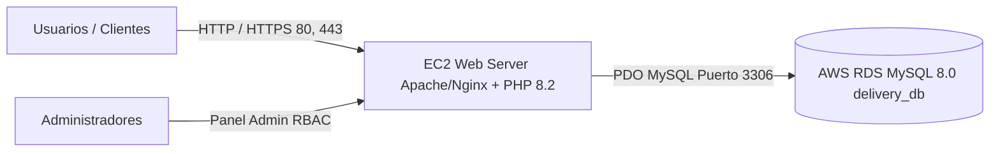

# Fast Delivery - Guía de Despliegue en AWS (EC2 + RDS MySQL)

Esta guía explica paso a paso cómo desplegar la plataforma **Fast Delivery** en Amazon Web Services utilizando una instancia **EC2** para la aplicación PHP y una base de datos administrada **RDS MySQL 8.0+** utilizando el script [SQL.db](file:///c:/Users/ASUS/Desktop/FastDelivery/SQL.db).

---

## 1. Arquitectura de la Solución



---

## 2. Configuración de la Base de Datos en AWS RDS

1. **Crear la Instancia RDS**:
   - Motor: **MySQL Community** (Versión 8.0 o superior).
   - Plantilla: **Capa gratuita (Free Tier)** o Producción (Multi-AZ).
   - Identificador de BD: `fastdelivery-rds`.
   - Nombre de base de datos inicial: `delivery_db`.
   - Usuario Maestro: `admin` (o el de su preferencia).
   - Asignar una contraseña segura.

2. **Configuración de Red y Seguridad (Security Groups)**:
   - Crear un Grupo de Seguridad para RDS (ej: `rds-fastdelivery-sg`).
   - Regla de entrada: **MySQL/Aurora (Puerto 3306)** con origen en el Grupo de Seguridad de su instancia EC2 (`ec2-fastdelivery-sg`). **Nunca abrir el puerto 3306 a 0.0.0.0/0 en producción**.

3. **Importar el Script de Base de Datos**:
   Desde su terminal (conectado a la misma VPC o vía EC2):
   ```bash
   mysql -h <ENDPOINT-RDS-AQUI> -P 3306 -u admin -p delivery_db < SQL.db
   ```

---

## 3. Configuración del Servidor Web en AWS EC2

1. **Lanzar Instancia EC2**:
   - AMI: **Ubuntu 22.04 LTS** o **Amazon Linux 2023**.
   - Tipo de Instancia: `t3.micro` o `t3.small`.
   - Grupo de Seguridad: Permitir puertos `22` (SSH), `80` (HTTP), `443` (HTTPS).

2. **Instalación de Dependencias (Ubuntu)**:
   ```bash
   sudo apt update && sudo apt upgrade -y
   sudo apt install -y apache2 php libapache2-mod-php php-mysql php-mbstring php-xml php-curl git
   sudo a2enmod rewrite
   sudo systemctl restart apache2
   ```

3. **Clonar o Desplegar el Proyecto**:
   ```bash
   cd /var/www/html
   git clone <URL_REPOSITORIO> fastdelivery
   sudo chown -R www-data:www-data /var/www/html/fastdelivery
   ```

4. **Configurar el archivo `.env`**:
   Crear el archivo `/var/www/html/fastdelivery/.env`:
   ```ini
   DB_HOST=fastdelivery-rds.xxxxxx.us-east-1.rds.amazonaws.com
   DB_PORT=3306
   DB_NAME=delivery_db
   DB_USER=admin
   DB_PASS=SuContraseñaRDS_Aqui
   DB_CHARSET=utf8mb4
   ```

5. **Configurar VirtualHost de Apache (Opcional pero recomendado)**:
   ```apache
   <VirtualHost *:80>
       ServerAdmin webmaster@fastdelivery.com
       DocumentRoot /var/www/html/fastdelivery

       <Directory /var/www/html/fastdelivery>
           Options -Indexes +FollowSymLinks
           AllowOverride All
           Require all granted
       </Directory>

       ErrorLog ${APACHE_LOG_DIR}/fastdelivery_error.log
       CustomLog ${APACHE_LOG_DIR}/fastdelivery_access.log combined
   </VirtualHost>
   ```

---

## 4. Cuentas de Acceso por Defecto en la Base de Datos

Las cuentas iniciales creadas por [SQL.db](file:///c:/Users/ASUS/Desktop/FastDelivery/SQL.db) con contraseñas encriptadas con `BCRYPT`:

| Rol | Usuario / Correo | Contraseña | Destino al Iniciar Sesión |
| :--- | :--- | :--- | :--- |
| **Administrador** | `admin@fastdelivery.com` | `admin123` | [Panel de Productos (admin.php)](file:///c:/Users/ASUS/Desktop/FastDelivery/Frontend/admin.php) |
| **Cliente** | `cliente@fastdelivery.com` | `cliente123` | [Seleccionar Productos (productos.php)](file:///c:/Users/ASUS/Desktop/FastDelivery/Frontend/productos.php) |
| **Repartidor** | `repartidor@fastdelivery.com` | `repartidor123` | [Panel de Repartidor (repartidor.php)](file:///c:/Users/ASUS/Desktop/FastDelivery/Frontend/repartidor.php) |
